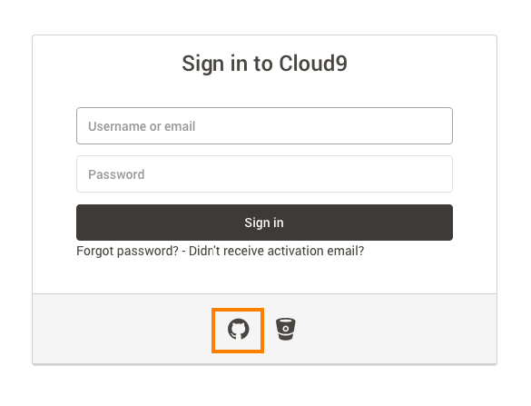
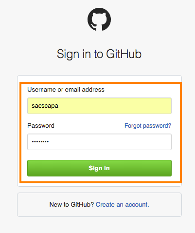
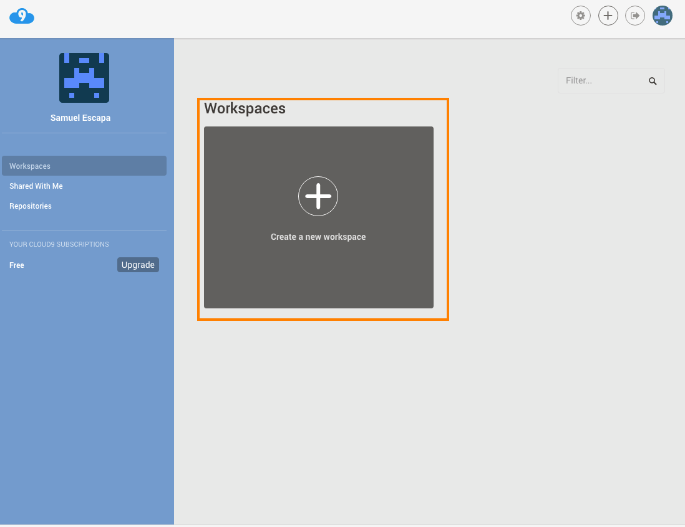
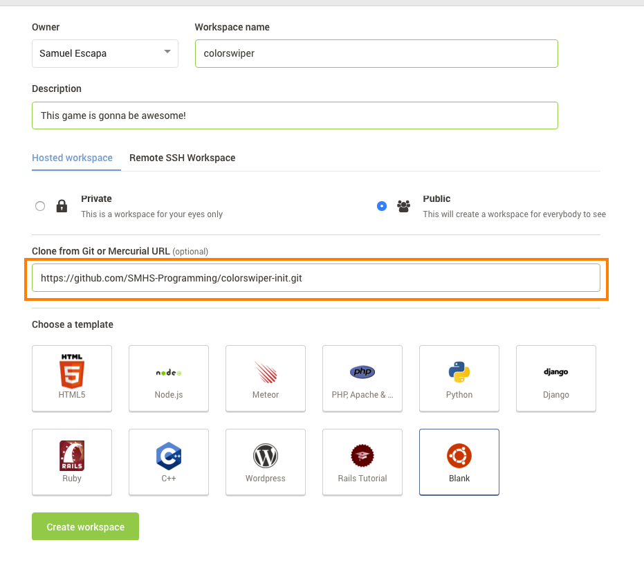
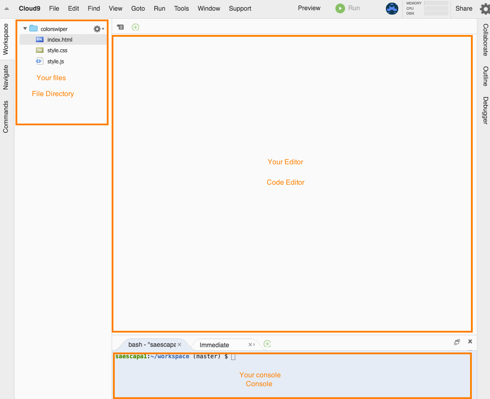

# ColorSwiper

Hey there! Welcome to ColorSwiper! This is a workshop created by the SMHS Programming Club.

Goals: Create a web version of [Swiper](https://github.com/hackclub/hackclub/blob/master/workshops/swiper/README.md)

What you will learn: HTML/CSS and jQuery.

As we go by, this README will be updated to the current progress we are in. Hopefully by the end, we would have built an amazing game and workshop for others to use.

## Index

- [Getting started](#getting-started)
- [Get to know how to test your app](#get-to-know-how-to-test-your-game)

## Getting Started

- Start off going into [c9.io](https://c9.io). We will be working most of time on this platform.


- Create an account and/or login with your Github Account.




- Once you logged in, click on the big ```Create a new workspace```.



- Fill out the information just like in the image below, with your custom name and description.
- **IMPORTANT** Fill the 'Clone from Git or Mercurial URL' with: ```https://github.com/SMHS-Programming/colorswiper-init.git```



- Throughout the workshop, we will be using these terms below.



Get Started!

## Get to know how to test Your Game.

- Start by opening ```index.html```, which will pop up on your editor.
- Follow up by going into the console, and typing in the following command:

```
curl -sL https://git.io/vtbp6 | sudo dd of=/usr/local/bin/live_reload && sudo chmod +x /usr/local/bin/live_reload && live_reload
```

- This might take a couple of minutes.


- Once done (with ```Watching Files...```), hop into your editor and type in anything you want on the body tags.
- Now, to demonstrate your app, go into ```Preview```, hit the Run as Live Application.
- And you are all set! Now you have learned how to run your application from c9.io.


