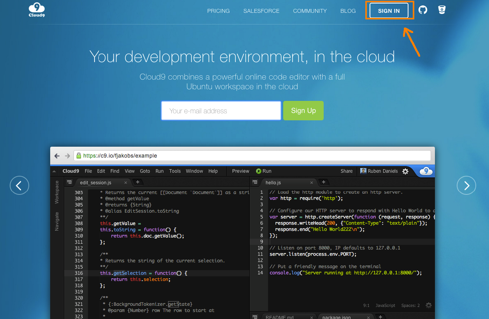

# ColorSwiper

Hey there! Welcome to ColorSwiper! This is a workshop created by the SMHS Programming Club.

Goals: Create a web version of [Swiper](https://github.com/hackclub/hackclub/blob/master/workshops/swiper/README.md)

What you will learn: HTML/CSS and jQuery.

As we go by, this README will be updated to the current progress we are in. Hopefully by the end, we would have built an amazing game and workshop for others to use.

## Index

- [Getting started](#getting-started)
- [Get to know how to test your app](#get-to-know-how-to-test-your-game)
<!-- - [Structuring your game](#structuring-your-game) -->

## Getting Started

- Start off going into [c9.io](https://c9.io). We will be working most of time on this platform.



- Create an account and/or login with your Github Account.


- Once you logged in, click on the big ```Create a new workspace```.


- Fill out the information just like in the image below, with your custom name and description.
- **IMPORTANT** Fill the 'Clone from Git or Mercurial URL' with: ```https://github.com/SMHS-Programming/colorswiper-init.git```


- Throughout the workshop, we will be using these terms below.


Get Started!

## Get to know how to test Your Game.

- Start by opening ```index.html```, which will pop up on your editor.
- Hop into your editor and type in anything you want on the body tags.
- Now, to demonstrate your app, right click on the file, and click ```Preview```.


- And you are all set! Now you have learned how to run your application from c9.io.

<!-- ## Stucturing your game

- Our game constitutes of 3 main parts.
- Title of the Gam -->
